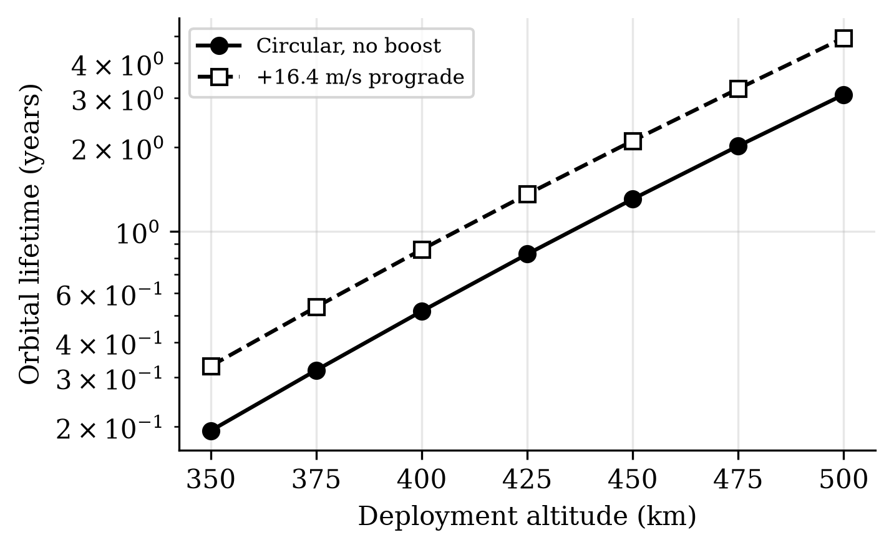

# Orbital Deployment Trade Study

<p align="center"></p>

[](https://github.com/aaaaaaaaaaaavm/orbital-deployment-trade-study/actions/workflows/ci.yml)
[](LICENSE)
[](pyproject.toml)
[](docs/PROVENANCE.md)

An installable preliminary calculator for tangential deployment impulses, phase drift, host
recoil and the rigid-body disturbance from a closed internal mass move.

**Status: two-body and rigid-body trade study.** This does not perform conjunction assessment,
replace a launch-provider analysis or establish flight safety. Atmosphere, covariance,
flexible modes and host control require higher-fidelity tools and mission data.

## Why this exists

VOLLEY's astrodynamics record mixes four questions that do not have the same evidence:

1. what a tangential impulse does to a circular orbit;
2. how mean-motion difference accumulates phase;
3. what linear recoil magnitude the host receives;
4. what ideal angular motion follows an internal mass transfer.

The first three are useful screening calculations. The fourth is here because a VOLLEY audit
found that peak rate had been mistaken for residual rate. A symmetric closed move returns to
**zero ideal residual body rate** but leaves an attitude offset. That correction removed a
false 18.1 s cadence floor; it did not produce a host-controller or structural-settling model.

## What the calculator does

- derives the post-impulse ellipse from specific energy and angular momentum;
- computes phase-drift time from the difference in mean motion;
- reports host recoil as a magnitude from linear-momentum conservation;
- separates transient peak rate, attitude offset and ideal residual rate;
- rejects unbound or Earth-intersecting trajectories rather than returning plausible numbers;
- includes one VOLLEY reference case and one independent hosted-6U example.

## Run it

```bash
python -m pip install -e .
orbital-trade cases/hosted_6u_example.json
orbital-trade cases/volley_reference.json --out build/volley_reference.json
```

## Verify it

```bash
python -m unittest discover -s tests -v
python tools/verify_repository.py
```

The tests cover zero impulse, prograde and retrograde geometry, unbound rejection, momentum
conservation, recoil sign convention and the corrected closed internal move.

## Evidence boundary

The committed VOLLEY astrodynamics, payload-family, attitude and validation sources remain
under `reference/volley/`. Their uncomfortable results remain attached:

| Item | Current record |
|---|---|
| A5 | **FAIL** — GMAT falsified the claimed solar-activity invariance |
| A6 | three probability-spread rows remain **VOID**; no operational covariance or CDM |
| A9 | **NOT RUN** against flown public orbital history |
| A13 | corrected zero ideal residual rate; structural settling and control remain open |

NASA GMAT reproduced and challenged numerical claims. NASA did not validate or endorse VOLLEY.

## Repository layout

- `src/orbital_trade/` — two-body, recoil and internal-mass screening functions;
- `cases/` — one VOLLEY case and one non-VOLLEY hosted-6U case;
- `tests/` — limiting cases, conservation checks and rejection paths;
- `reference/volley/` — files retained byte-for-byte from VOLLEY commit `aa22a06`;
- `docs/` — validation boundary, tool versions, provenance, decisions and roadmap.

See [summary](SUMMARY.md), [validation](docs/VALIDATION.md),
[toolchain](docs/TOOLCHAIN.md), [provenance](docs/PROVENANCE.md), and
[open problems](OPEN_PROBLEMS.md).

## License

MIT. External tools and public orbital data retain their own terms.
